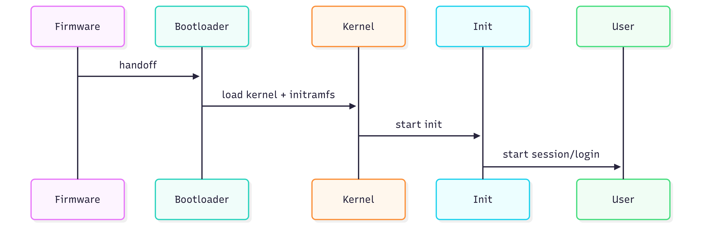

# 03. Linux Basics and System Startup

## Learning Objectives

* Describe the boot process from firmware to user login.
* Understand kernel, init systems, and basic filesystem layout.

## Key Concepts Explained

* **Boot Process Overview**

  * Plain-language: The machine powers up, firmware (BIOS/UEFI) initializes hardware, then loads a bootloader which starts the kernel, which mounts root and starts the init system to bring services up.
  * Why it matters: Troubleshooting boot failures requires knowing where things can break.
  * Internal workings: Stages — firmware → bootloader (GRUB) → kernel initramfs → kernel → init/systemd.

* **Kernel, Init, and Services**

  * Kernel: core of the OS managing hardware, processes, drivers.
  * Init/System manager: systemd (common), SysV init, runit — manages services and user sessions.

* **Filesystem Basics**

  * Standard layout: /, /boot, /etc, /var, /home, /usr, /opt.
  * Why layout matters: predictable locations for configuration, binaries, and variable data.

## Commands & Examples

```bash
# Check current init system (systemd usually)
ps -p 1 -o comm=

# View boot messages
journalctl -b

# Show mounted filesystems
lsblk -f
```

## Real-World Usage Scenarios

* Recovering from a broken kernel by selecting an alternate kernel in GRUB.
* Inspecting `journalctl` output after a failed service start.

## Common Mistakes & Best Practices

* Mistake: Editing GRUB or kernel parameters carelessly without backups.
* Best practice: Keep a known-good configuration and know how to use a live USB to repair boot problems.

## Diagrams & Assets

1. Boot Process Diagram

```

```

Description: Sequential stages from firmware to user session.

## Summary

Booting is a deterministic sequence; understanding each stage (firmware → bootloader → kernel → init) is essential for system recovery and reliable operation.


